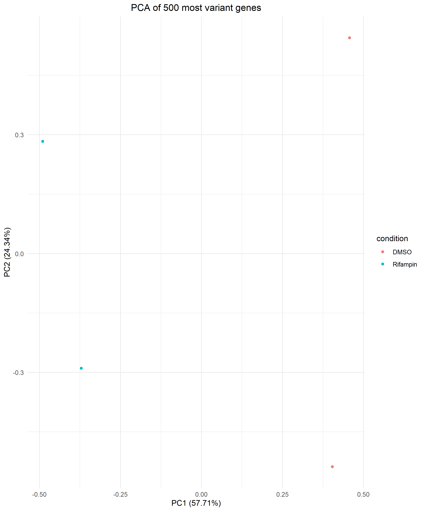
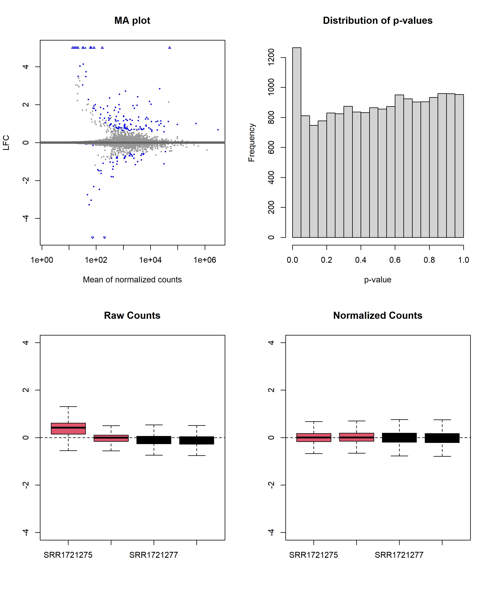

# cyp3a4_rna_seq

## Summary

## Introduction

## Quality control, trimming & read mapping

Four human hepatocyte samples were used, two treated with DMSO and two treated with rifampin to study the effects of rifampin on gene expression (**Tab. 1**). The SRAtoolkit was used to download the corresponding FASTQ files and FASTQC was used for quality control. The process was organized as a pipeline in the bash script `download_fastqc_pipe.sh`.

The initial quality check revealed medium quality reads with high adapter content at the 3' ends and prominent poly A tails. To improve quality and mapping rates, Illumina universal adapters and poly-A tails were trimmed using Cutadapt. Reads with a quality score below 20 were removed and reads shorter than 50 bases were filtered out (`trimming_pipe.sh`).

This trimming process increased mapping rates by approximately 5% across all samples, although mapping rates still varied between 65% and 80%. 

**Table 1: Overview of the Datasets Used.**

| Experiment Number | Description |
| ----------------- | ----------- |
| SRR1721275        | Rifampin    |
| SRR1721276        | Rifampin    |
| SRR1721277        | DMSO        |
| SRR1721278        | DMSO        |

## Exploratory data analysis

During the exploratory data analysis, the quantified gene expression data was filtered to exclude genes with fewer than 10 total counts across all samples. This filtering reduced the dataset from 62,749 original genes to 23,845 retained for further analysis. To perform differential expression analysis, the transcript counts were summarized at the gene level using tximeta, creating a DESeq dataset. A variance-stabilized version of the dataset was then generated, providing a foundation for clustering and other analyses.

Principal component analysis (PCA) of the 500 most variant genes revealed that the samples clustered based on treatment, indicating that rifampin and DMSO treatments affected gene expression in distinct ways (**Fig. 1**). However, there was also considerable variance within the clusters, particularly between the rifampin samples and even more so between the DMSO samples. This variance between samples suggests that while treatment has a significant impact on gene expression, other factors may also be contributing to the observed patterns. Despite this variance, the PCA results indicate that rifampin treatment induced notable changes in gene expression, suggesting it has a strong impact on the transcriptome.

  

**Figure 1: PCA of 500 most variant genes.**
  

## Differential expression analysis

For differential expression analysis, DESeq2 was used to identify genes with significant changes in expression. Using an adjusted p-value threshold of 0.1, 128 genes were identified as upregulated (0.54%) and 61 genes as downregulated (0.26%). No outliers were detected, while 5,086 genes (21%) had low counts. Notably, the majority of genes are upregulated in response to rifampin treatment, a trend that has also been corroborated by ChIP-seq analysis (see [part 1](https://github.com/ManuelGehl/cyp3a4_chip_seq) of this project).

Quality checks such as MA plots and exploratory data analysis (EDA) plots indicated that the data were well distributed, although a large proportion of genes still had low counts (**Fig. 2**). The distribution of p-values reflected this, suggesting that many genes were expressed at low levels.

  

**Figure 2: MA plot (top-left), distribution of p-values (top-right) and EDA plots with raw counts (bottom-left) and normalized counts (bottom-right).**
  

The dataset was then filtered to remove entries with NA in the adjusted p-values, adjusted p-values greater than 0.1, or absolute log2 fold changes less than 1. This resulted in a list of 133 differentially expressed genes that closely matched the 157 genes identified by the authors of the original study. Interestingly, 11 of the 133 differentially expressed genes were from the CYP450 family, the same number as identified in the original study, of which CYP3A4, CYP3A43, CYP2C8, CYP2B6 and CYP3A5 were also found overexpressed in their qPCR results.

  

**Figure 3: Volcano plot of detected genes.**
  

Using these 133 differentially expressed genes, a Principal Component Analysis (PCA) plot was constructed using variance-stabilized transformed (VST) counts. This plot showed that the treated samples clustered together, and the explainable variance between groups decreased significantly from an initial 24% to approximately 4%. This indicated a strong effect of treatment, with much of the remaining variance explained by differences in gene expression induced by rifampin or DMSO treatment.
